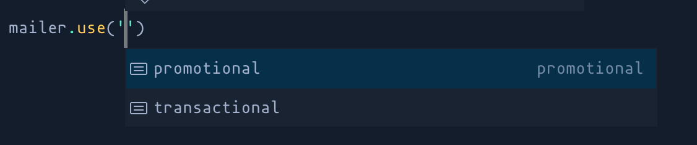
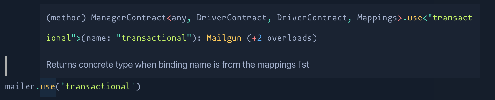

<div align="center">
	
</div>

# Manager Pattern

> Implementation of the Manager pattern used by AdonisJS

[![gh-workflow-image]][gh-workflow-url] [![typescript-image]][typescript-url] [![npm-image]][npm-url] [![license-image]][license-url] [![synk-image]][synk-url]

Manager pattern is a way to ease the construction of objects of similar nature. To understand it better, we will follow an imaginary example through out this document.

<!-- START doctoc generated TOC please keep comment here to allow auto update -->
<!-- DON'T EDIT THIS SECTION, INSTEAD RE-RUN doctoc TO UPDATE -->
## Table of contents

- [Scanerio](#scanerio)
- [Basic implementation](#basic-implementation)
- [Using a Manager Class](#using-a-manager-class)
  - [Step1: Define a sample config object.](#step1-define-a-sample-config-object)
  - [Step 2: Create manager class and accept mappings config](#step-2-create-manager-class-and-accept-mappings-config)
  - [Step 3: Using the config to constructor drivers](#step-3-using-the-config-to-constructor-drivers)
  - [Step 4: Move drivers construction into the manager class](#step-4-move-drivers-construction-into-the-manager-class)
- [Usage](#usage)
- [Extending from outside-in](#extending-from-outside-in)
- [Driver Interface](#driver-interface)
  - [Defining Drivers Interface](#defining-drivers-interface)
  - [Passing interface to Manager](#passing-interface-to-manager)
- [Mappings Type](#mappings-type)
  - [Mapping suggestions](#mapping-suggestions)
  - [Return type](#return-type)

<!-- END doctoc generated TOC please keep comment here to allow auto update -->

## Scanerio

Let's imagine we are creating a mailing library and it supports multiple drivers like: **SMTP**, **Mailgun**, **PostMark** and so on. Also, we want the users of our library to use each driver for multiple times using different configuration. For example:

Using the **Mailgun driver with different accounts**. Maybe one account for sending promotional emails and another account for sending transactional emails.

## Basic implementation

The simplest way to expose the drivers, is to export them directly and let the consumer construct instances of them. For example:

```ts
import { Mailgun } from 'my-mailer-library'

const promotional = new Mailgun(configForPromtional)
const transactional = new Mailgun(configForTransactional)

promotional.send()
transactional.send()
```

The above approach works perfect, but has few drawbacks

- If the construction of the drivers needs more than one constructor arguments, then it will become cumbersome for the consumer to satisfy all those dependencies.
- They will have to manually manage the lifecycle of the constructed objects. Ie `promotional` and `transactional` in this case.

## Using a Manager Class

What we really need is a Manager to manage and construct these objects in the most ergonomic way.

### Step1: Define a sample config object.

First step is to move the mappings to a configuration file. The config mimics the same behavior we were trying to achieve earlier (in the Basic example), but defines it declaratively this time.

```ts
const mailersConfig = {
  default: 'transactional',

  list: {
    transactional: {
      driver: 'mailgun',
    },

    promotional: {
      driver: 'mailgun',
    },
  },
}
```

### Step 2: Create manager class and accept mappings config

```ts
import { Manager } from '@poppinss/manager'

class MailManager implements Manager {
  protected singleton = true

  constructor(private config) {
    super({})
  }
}
```

### Step 3: Using the config to constructor drivers

The **Base Manager** class will do all the heavy lifting for you. However, you will have to define certain methods to resolve the values from the config file.

```ts
import { Manager } from '@poppinss/manager'

class MailManager implements Manager {
  protected singleton = true

  protected getDefaultMappingName() {
    return this.config.default
  }

  protected getMappingConfig(mappingName: string) {
    return this.config.list[mappingName]
  }

  protected getMappingDriver(mappingName: string) {
    return this.config.list[mappingName].driver
  }

  constructor(private config) {
    super({})
  }
}
```

### Step 4: Move drivers construction into the manager class

The final step is to write the code for constructing drivers. The **Base Manager** uses a convention for this. Anytime the consumer will ask for the `mailgun` driver, it will invoke `createMailgun` method. So the convention here is to prefix `create` followed by the camelCase driver name.

```ts
import { Manager } from '@poppinss/manager'

class MailManager implements Manager {
  // ... The existing code

  public createMailgun(mappingName, config) {
    return new Mailgun(config)
  }

  public createSmtp(mappingName, config) {
    return new Smtp(config)
  }
}
```

## Usage

Once done, the consumer of the Mailer class just needs to define the mappings config and they are good to go.

```ts
const mailersConfig = {
  default: 'transactional',

  list: {
    transactional: {
      driver: 'mailgun',
    },

    promotional: {
      driver: 'mailgun',
    },
  },
}

const mailer = new MailManager(mailersConfig)

mailer.use('transactional').send()
mailer.use('promotional').send()
```

- The lifecycle of the mailers is now encapsulated within the manager class. The consumer can call `mailer.use()` as many times as they want, without worrying about creating too many un-used objects.
- They just need to define the mailers config once and get rid of any custom code required to construct individual drivers.

## Extending from outside-in

The Base Manager class comes with first class support for adding custom drivers from outside-in using the `extend` method.

```ts
const mailer = new MailManager(mailersConfig)

mailer.extend('postmark', (manager, mappingName, config) => {
  return new PostMark(config)
})
```

The `extend` method receives a total of three arguments:

- The `manager` object is the reference to the `mailer` object.
- The name of the mapping inside the config file.
- The actual configuration object.
- The `callback` should return an instance of the Driver.

## Driver Interface

The Manager class can also leverage static Typescript types to have better intellisense support and also ensure that the drivers added using the `extend` method adhere to a given interface.

### Defining Drivers Interface

Following is a dummy interface, we expect all drivers to adhere too

```ts
interface DriverContract {
  send(): Promise<void>
}
```

### Passing interface to Manager

```ts
import { Manager } from '@poppinss/manager'
import { DriverContract } from './Contracts'

class MailManager implements Manager<DriverContract> {}
```

## Mappings Type

The mappings config currently has `any` type and hence, the `mailer.use` method cannot infer correct return types.

In order to improve intellisense for the `use` method. You will have to define a type for the mappings too.

```ts
type MailerMappings = {
  transactional: Mailgun
  promotional: Mailgun
}

type MailerConfig = {
  default: keyof MailerMappings
  list: {
    [K in keyof MailerMappings]: any
  }
}

const mailerConfig: MailerConfig = {
  default: 'transactional',

  list: {
    transactional: {
      driver: 'mailgun',
      // ...
    },

    promotional: {
      driver: 'mailgun',
      // ...
    },
  },
}
```

Finally, pass the `MailerMappings` to the Base Manager class

```ts
import { DriverContract, MailerMappings } from './Contracts'

class MailManager implements Manager<DriverContract, DriverContract, MailerMappings> {}
```

Once mailer mappings have been defined, the `use` method will have proper return types.

### Mapping suggestions



### Return type



[gh-workflow-image]: https://img.shields.io/github/workflow/status/poppinss/manager/test?style=for-the-badge
[gh-workflow-url]: https://github.com/poppinss/manager/actions/workflows/test.yml "Github action"

[typescript-image]: https://img.shields.io/badge/Typescript-294E80.svg?style=for-the-badge&logo=typescript
[typescript-url]: "typescript"

[npm-image]: https://img.shields.io/npm/v/@poppinss/manager.svg?style=for-the-badge&logo=npm
[npm-url]: https://npmjs.org/package/@poppinss/manager 'npm'

[license-image]: https://img.shields.io/npm/l/@poppinss/manager?color=blueviolet&style=for-the-badge
[license-url]: LICENSE.md 'license'

[synk-image]: https://img.shields.io/snyk/vulnerabilities/github/poppinss/manager?label=Synk%20Vulnerabilities&style=for-the-badge
[synk-url]: https://snyk.io/test/github/poppinss/manager?targetFile=package.json 'synk'
